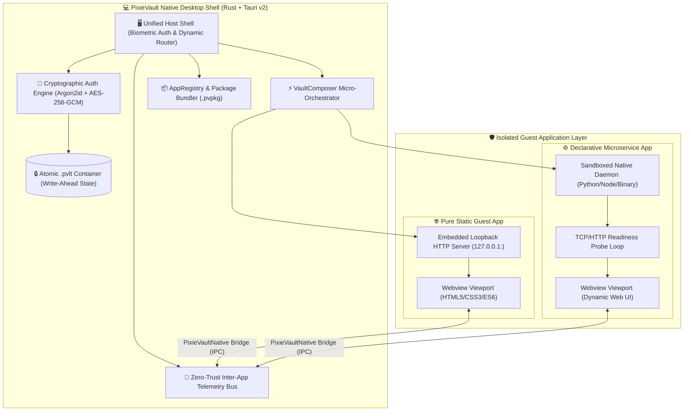

<div align="center">

# 💎 PixieVault

### **Zero-Trust, Air-Gapped Desktop Application Host & Micro-Orchestrator**

[](https://www.rust-lang.org/)
[](https://tauri.app/)
[](#-zero-trust-security-architecture)
[](#-zero-trust-security-architecture)
[](LICENSE)
[](#-platform-support)

<p align="center">
  <b>PixieVault is a zero-trust, air-gapped desktop application runtime that orchestrates offline web apps and microservices inside isolated sandboxes with biometric authentication, Inter-App bus telemetry, and hardware-backed AES-256 encrypted persistence.</b>
</p>

</div>

---

## 🧭 System Architecture



---

## ✨ Key Features

### 🛡️ Zero-Trust Encrypted Persistence
- **Military-Grade Cryptography**: All application state envelopes are encrypted using authenticated **AES-256-GCM** with deterministic **Argon2id** key derivation (64MB memory cost, 3 iterations, 4 parallel lanes).
- **Atomic Write-Ahead Storage**: Writes are executed atomically via temporary staging files and automatic write-ahead `.bak` snapshots to prevent data loss or file corruption during unexpected power cuts.
- **Corrupted Vault Auto-Recovery**: Built-in self-healing engine automatically detects tampering or serialization errors and seamlessly restores from validated backup stores.

### ⚡ Universal Guest Micro-Orchestrator (`VaultComposer`)
- **Declarative Microservice Supervision**: Define multi-process backends (Flask, FastAPI, Express, Go, Rust binaries) directly in `manifest.json`.
- **Dynamic Ephemeral Ports**: Backend daemons bind to randomly allocated loopback ports (`127.0.0.1:0`), completely eliminating port collisions (`EADDRINUSE`).
- **Transactional Rollback**: Fast-failure healthcheck probe loops verify process readiness before mounting viewports; if a service fails during startup, all child processes are immediately reaped and rolled back.
- **Embedded Loopback Static Web Server**: Pure static web applications are served via a high-performance, embedded loopback HTTP server with complete MIME type resolution, CORS headers, and path traversal security.

### 📦 Dual-Source Air-Gapped Distribution
- **Standalone `.pvpkg` Packages**: Export and import complete self-contained application bundles as single-file portable archives.
- **Zero Artifact Leaks**: Built-in packager strips virtualenvs (`.venv`), bytecode caches (`__pycache__`), local databases (`*.db`, `*.sqlite`), and secrets before building distribution packages.
- **Direct USB / Folder Mounting**: Mount raw offline application folders directly from removable media or external drives.

### 📡 Zero-Trust Inter-App Telemetry Bus
- **Secure Cross-App Messaging**: Guest applications publish metrics and state without direct socket connections or shared memory vulnerabilities.
- **Least-Privilege RBAC**: Guest applications explicitly request read/write permissions in `manifest.json`. Unauthorized queries are rejected by the Rust host kernel.

### 🔒 Hardware OS Biometrics
- **Native OS Integration**: Authenticate instantly via **Windows Hello** (facial recognition / fingerprint / PIN), **Apple Touch ID**, or **Linux PAM Keyring**.

---

## 📋 Application Manifest Specification

Applications declare their identity, entrypoint, permissions, and optional microservices via a root `manifest.json`:

```json
{
  "app_id": "sample_service_app",
  "name": "Sample Microservice Application",
  "version": "1.0.0",
  "description": "Autonomous local backend and modern web frontend orchestration",
  "entrypoint": "http://127.0.0.1:{{services.backend.port}}/",
  "presentation": {
    "icon": "assets/app-icon.svg",
    "accent": "#6366f1",
    "category": "Utilities"
  },
  "permissions": {
    "network": true,
    "sidecar": true,
    "bus_publish": true,
    "bus_subscribe": true
  },
  "composer": {
    "version": "1",
    "services": {
      "backend": {
        "command": ["python3", "app.py"],
        "working_dir": "backend",
        "port": "auto",
        "requirements": "requirements.txt",
        "healthcheck": {
          "endpoint": "/healthz",
          "interval_ms": 100,
          "timeout_ms": 10000,
          "expected_status": 200
        },
        "sandbox": {
          "enabled": true,
          "isolate_network_loopback": false
        }
      }
    }
  }
}
```

---

## 🚀 Quickstart Guide

### Prerequisites
- [Rust](https://www.rust-lang.org/tools/install) (1.78+)
- [Node.js](https://nodejs.org/) (v18+)
- [Python](https://www.python.org/) (3.10+)

### Running Locally

#### 🐧 Linux
```bash
# Clone the repository
git clone https://github.com/pixie-technology-code/PixieVault.git
cd PixieVault

# Install system dependencies (Ubuntu/Debian)
sudo apt-get update && sudo apt-get install -y libwebkit2gtk-4.1-dev libgtk-3-dev libayatana-appindicator3-dev librsvg2-dev bubblewrap

# Launch PixieVault Host
./run-linux.sh
```

#### 🪟 Windows
```powershell
# In PowerShell or Command Prompt:
.\run-windows.bat
# Or using PowerShell script directly:
.\run-windows.ps1
```

---

## 🧪 Comprehensive Multi-Tier Test Suite

PixieVault features an automated 4-tier verification suite covering unit tests, persistence integrity, live process orchestration, and end-to-end acceptance gates:

```bash
# Run all 4 test tiers (Linux)
./test-all.sh

# Run all 4 test tiers (Windows)
.\test-all.ps1
```

### Test Hierarchy:
1. **Tier 1: Pure Unit Tests** (`validate-manifests.js`, `validate-dist-assets.js`, `unit_tests.rs`)
2. **Tier 2: Filesystem & Persistence Tests** (`persistence_tests.rs`, `source_and_package_tests.rs`)
3. **Tier 3: Network & Process Orchestration** (`composer_tests.rs`, `sandbox_tests.rs`)
4. **Tier 4: End-to-End Acceptance Gate** (`acceptance_test.rs`, `smoke-test-packaged-bundle.js`)

---

## 💻 Platform Support

| Operating System | Webview Engine | Biometric Provider | Sandbox Isolation |
| :--- | :--- | :--- | :--- |
| **Windows 10 / 11** | Microsoft WebView2 | Windows Hello (`Win32 Security Credentials`) | AppContainer / Process Isolation |
| **Linux (Ubuntu/Fedora/Arch)** | WebKit2GTK 4.1 | Linux PAM / Secret Service Keyring | Linux Namespaces (`bubblewrap`) |
| **macOS (11.0+)** | Apple WebKit | Touch ID / LocalAuthentication API | macOS Seatbelt Sandbox |

---

## 📄 License

PixieVault is licensed under the [MIT License](LICENSE).
Distributed by **Pixie Technology**.
